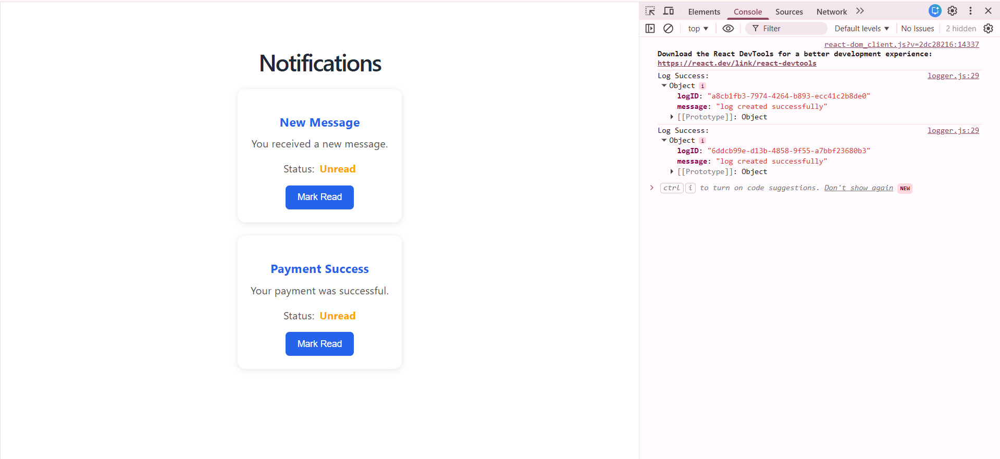
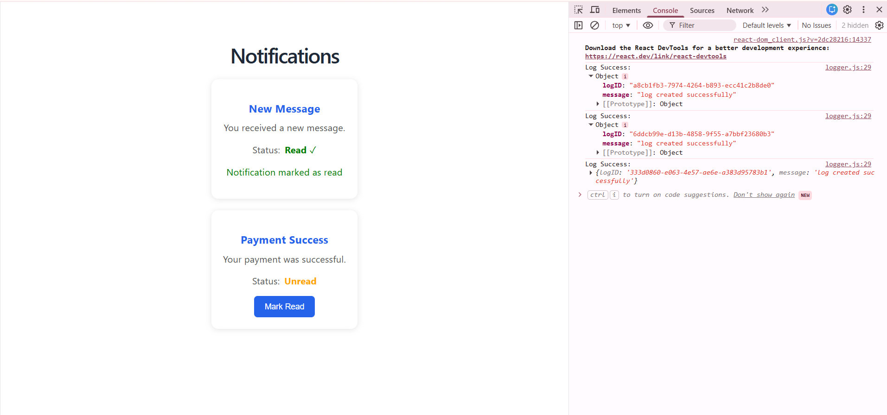
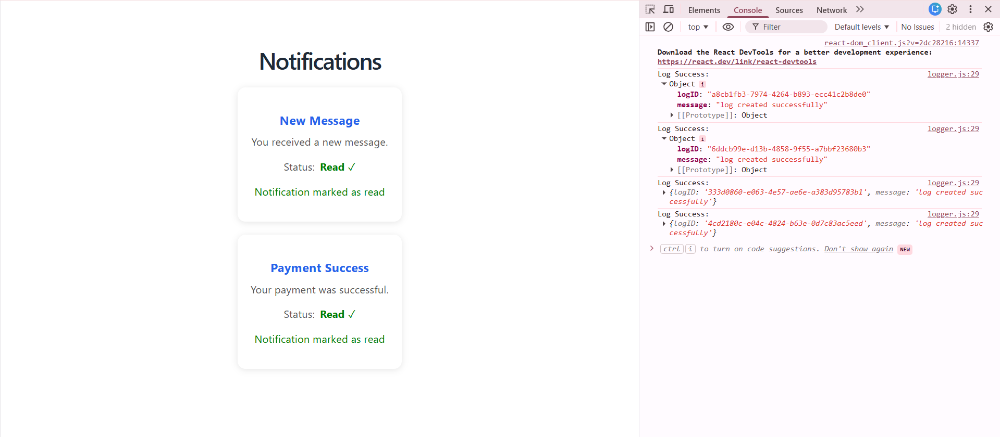
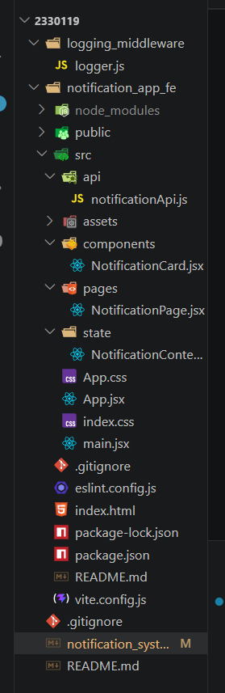

# Notification System Overview

This project is a React-based Notification System that displays notifications and integrates a reusable logging middleware. 
The middleware sends logs to the provided API to track page loads, user interactions, and state changes, making the application easier to monitor and debug.

# Working 

When the application starts, the Notification Page is loaded. At the same time, a log is generated indicating that the page has been opened.

The page displays a list of notifications. Each notification is shown using a Notification Card component.

When a user clicks the Mark Read button, the notification status changes and another log is generated to record the action.

This approach helps in monitoring how users interact with the application.

# SCREENSHOTS 

# Folder Structure 

# Types of Logs Used

Page Logs

Generated when the Notification Page is loaded.

Example:

Log(
  "frontend",
  "info",
  "page",
  "Notification page loaded"
);
Component Logs

Generated when the user interacts with a notification.

Example:

Log(
  "frontend",
  "info",
  "component",
  "Notification marked as read"
);
State Logs

Generated whenever the notification state changes.

Example:

Log(
  "frontend",
  "debug",
  "state",
  "Notification state updated"
);
